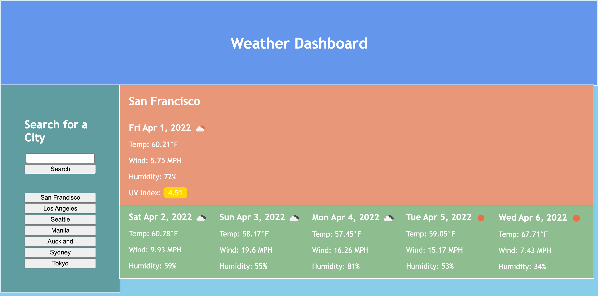

# weather-dashboard
Travelers want to see the weather outlook for multiple cities so that they can plan a trip accordingly

# Description of Work
1. When the user opens the weather dashboard they are presented with an input to search for a city.
2. When a city is entered and the 'Search' button is clicked, they are presented with current and future conditions for that city.
3. When the browser is refreshed, or another city is searched, that city is added to the search history.
4. When the user views current weather conditions for that city, they are presented with the city name, the date, an icon representation of weather conditions, the temperature, the humidity, the wind speed, and the UV index.
5. When they view the UV index, they are presented with a color that indicates whether the conditions are low, moderate, high, very high, or extreme.
6. When they view future weather conditions for that city, they are presented with a 5-day forecast that displays the date, an icon representation of weather conditions, the temperature, the wind speed, and the humidity.
7. When they click on a city in the search history, they are again presented with current and future conditions for that city.

# Screenshot of Browser

# Link to Deployed Page
https://jooreea.github.io/weather-dashboard/
